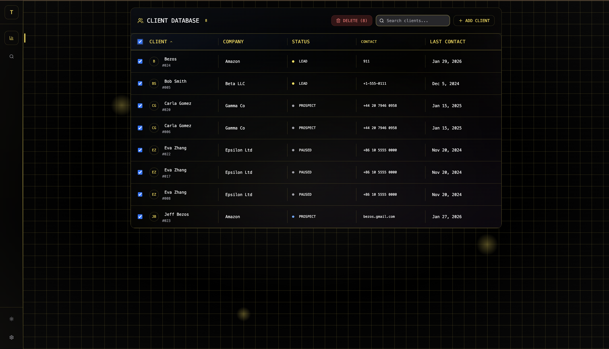
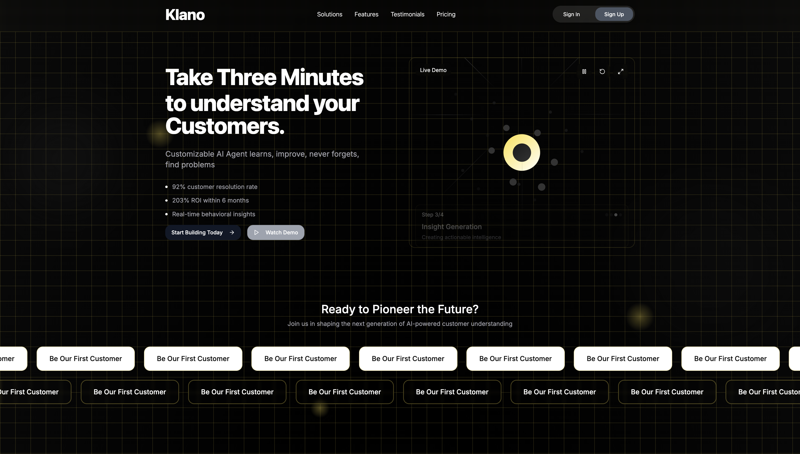
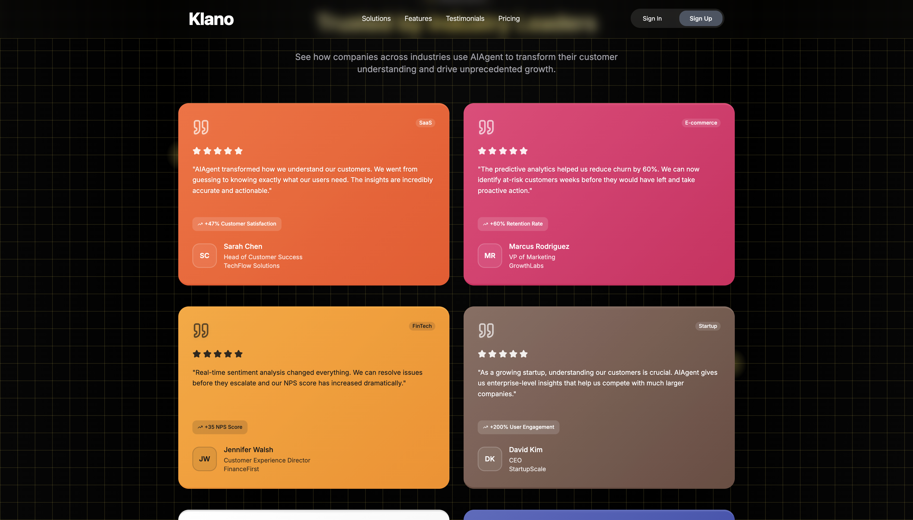

<p align="center">
  <h1 align="center">CRUD Template for CRM / Cold Email Tracker</h1>
</p>

<p align="center">
  A simple, extensible CRUD-based template designed for building CRM systems or cold email tracking tools.
</p>

---

## Key Features

### 1. Database Integration — Supabase
Robust backend powered by Supabase for data storage and real-time capabilities.

<p align="center">
  
  
</p>

---

### 2. Pretty Good UI (imo)
Clean, modern interface focused on usability and clarity.

<p align="center">
  
  <br />
  
</p>

---

### 3. Authentication Implementation (Google OAuth)
Secure authentication flow using Google OAuth.

<p align="center">
  
</p>

---

### 4. Search Feature
Quick and efficient search functionality to filter and locate records easily.

<p align="center">
  
</p>

---

##  Use Cases
- CRM systems  
- Cold email tracking  
- Internal dashboards  
- Startup MVPs  
- Admin panels  

---

## Tech Stack
- Frontend: *(add your framework here — e.g. Next.js, React)
- Backend: Supabase  
- Auth: Google OAuth  
- Database: PostgreSQL (via Supabase)


## Get Started 

To run the development server:

```bash
npm run dev
# or
yarn dev
# or
pnpm dev
# or
bun dev
```
